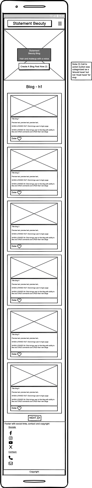
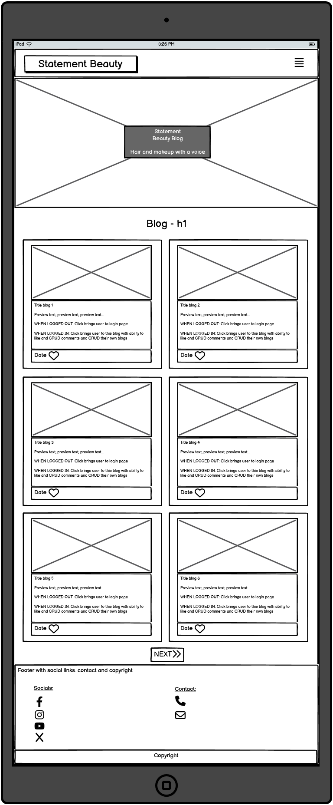
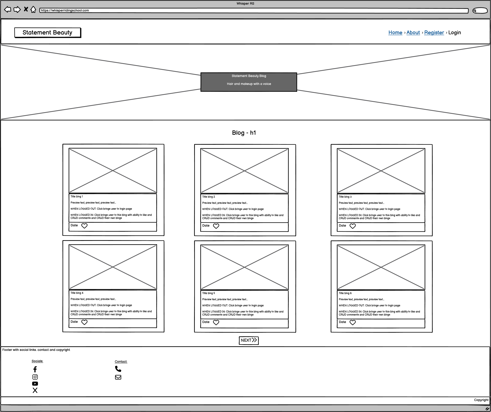

# Statement Beauty Blog

(Developer: Katie Dunne)

## Live website

Link to live website: [Statement Beauty](https://statement-beauty-ec9472f892b1.herokuapp.com/about/)

## Purpose of the project

## Table of contents

## User experience (UX)

### Key project goals

### Target audience

### User requirements and expectations

## Epics and user stories

### Epics

1. Fully functioning home page
2. Database and admin setup
3. Register page and form
4. Login page and form
5. Home page that looks different when logged in
6. Blog that has different capabilities when logged in compared to when not logged in
7. Log out page
8. About page

### User stories

- As a website user, I can:

1. Understand the purpose of this website quickly, so that I can stay interested and use the website to its full capability (Part of epic 1)
2. Navigate easily, so that I use all the capabilities of the website (Part of epic 1)
3. View a list of blogs that this site contains, so that I can find the posts I am interested in (Part of epic 1)
4. View the date a blog post was created, so that it is obvious which blogs are recent (Part of epic 1)
5. View the number of likes on blogs, so that it's easy to see which ones are popular (Part of epic 1)
6. Click on a blog post of interest that will then send the user to the login page, so that they can log in if not already logged in (Part of epic 4)
7. Register for an account, so that they can avail of the services offered to members (Part of epic 3)
8. Navigate to an about page, so that the user can view the overall mission statement of the website (Part of epic 8)

- As logged in website user, I can:

1. Like and unlike blog posts, so that I can show other users which posts are interesting (Part of epic 6)
2. Comment on blog posts, so that I can give my opinion and feel lots of interactivity with the website (Part of epic 2 and 6)
3. Read other users comments, so that I feel connected to a community (Part of epic 6)
4. Edit comments I made, so that I feel in control of the content I add to the website (Part of epic 2 and 6)
5. Delete my comments, so that I do not have to leave comments on the website forever (Part of epic 2 and 6)
6. Logout from the website, so that when I'm finished on the website, my comments are protected from editing by other computer users (Part of epic 5 and 7)

## Features

### Logo and navigation bar

### Footer

## Future features

## Design

## Wireframes

### Index page wireframes

## Technology

### Languages

### Frameworks & Tools

## Testing

### Accessibility and Lighthouse

### Fixed bugs

### Unfixed bugs

### Supported screens and browsers

## Deployment

## Credits

### Code

### Media

### Inspiration for structure from CI walk through and other CI students

### Inspiration from beauty blogs

## Acknowledgements

Thank you to friends, family and pets for the huge support. Also thank you to my mentor and CI cohort facilitator :sparkles:
