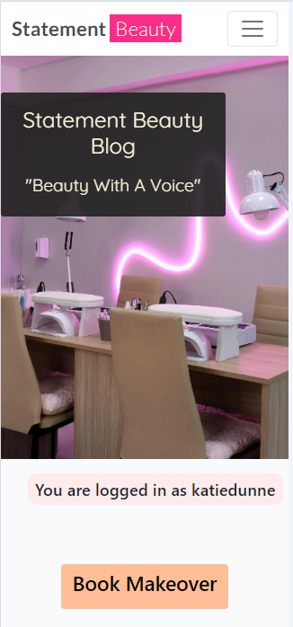
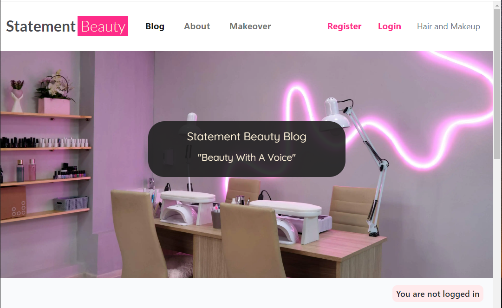
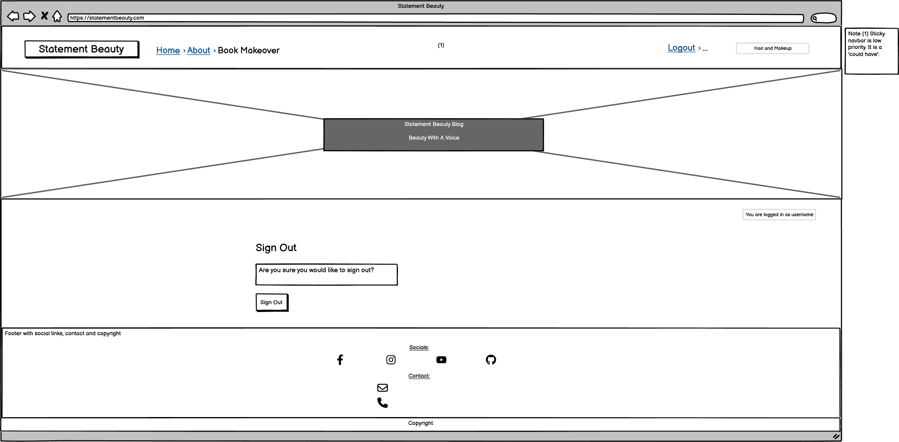

# Statement Beauty Blog

(Developer: Katie Dunne)

## Live website

Link to live website: [Statement Beauty](https://statement-beauty-ec9472f892b1.herokuapp.com/about/)

## Purpose of the project

Statement Beauty is a fictitious business that started out as a blog and had so much interest from expert beauticians that they were able to start offering makeover appointments (hair or makeup), which could be booked on the same site as the blog. This is a full stack website built using the Django web framework, with the aim of converting blog readers into makeover customers. This website provides the user with; a blog, comments sections, an about page to read about the business owner and the business itself, a form for users that are not registered to make collaboration requests, and an app for registered website users to make bookings for a makeover. The makeover app also describes whatever deal we have on makeovers, trending at that time. 

## Table of contents

## User experience (UX)

### Key project goals

-	Increase awareness of the Statement Beauty business, through a feel-good and accessible website that offers information of all things beauty through blogs
-	Encourage beauty professionals to get in contact if they would like to collaborate on blog posts or offer their services for our makeovers
-	Build a website that encourages and directs the site users to book a makeover with us

### Target audience

- Users that are interested in current beauty trends and topics
- Users that would like to book to have their hair or makeup done for an upcoming event
- Users that are professionals in the beauty industry and would like to collaborate on blog posts or offer their own services through our makeover service

### User requirements and expectations

- An intuitively structured and visually appealing website that is easy to read on all screen sizes
- Navigation that is easy to use and understand whether using mobile, tablet or monitor
- Ability to quickly understand the purpose of the website
- An ability to register, login and logout
- An ability to interact with content by commenting
- An ability to read comments that have been made under blogs
- An ability to update and delete comments if desired
- An ability to find relevant information on the business and its services
- Access to a collaboration form
- An ability to make a booking for a makeover
- An ability to see a list of their own bookings
- An ability to update and delete bookings if desired
- Easy ways to contact the business
- An accessible website for all users

## Epics and user stories

### Epics

1. Fully functioning home page
2. Database and admin setup
3. Register page and form
4. Login page and form
5. Home page that looks different when logged in
6. Blog that has different capabilities when logged in compared to when not logged in
7. Log out page
8. About page
9. Book makeover

### User stories

- As a website user, I can:

1. Understand the purpose of this website quickly, so that I can stay interested and use the website to its full capability (Part of epic 1)
2. Navigate easily, so that I use all the capabilities of the website (Part of epic 1)
3. View a list of blogs that this site contains, so that I can find the posts I am interested in (Part of epic 1)
4. View the date a blog post was created, so that it is obvious which blogs are recent (Part of epic 1)
5. View the number of likes on blogs, so that it's easy to see which ones are popular (Part of epic 1)
6. Click on a blog post of interest that will then send the user to the login page, so that they can log in if not already logged in (Part of epic 4)
7. Register for an account, so that they can avail of the services offered to members (Part of epic 3)
8. Navigate to an about page, so that the user can view the overall mission statement of the website (Part of epic 8)

- As logged in website user, I can:

1. Like and unlike blog posts, so that I can show other users which posts are interesting (Part of epic 6)
2. Comment on blog posts, so that I can give my opinion and feel lots of interactivity with the website (Part of epic 2 and 6)
3. Read other users comments, so that I feel connected to a community (Part of epic 6)
4. Edit comments I made, so that I feel in control of the content I add to the website (Part of epic 2 and 6)
5. Delete my comments, so that I do not have to leave comments on the website forever (Part of epic 2 and 6)
6. Logout from the website, so that when I'm finished on the website, my comments are protected from editing by other computer users (Part of epic 5 and 7)
7. View deals of the season on makeovers, so that I can save some money by booking the makeover that is trending (Part of epic 9)
8. Fill in a form on the book makeover tab, so that I can inform the business owner of a time that suits me for my makeover

- As a logged in superuser, I can:

1. Create blog posts, so that I can share my opinion on certain beauty products and looks (Part of epic 2 and 6)
2. Read other users blog posts, so that I research what is trendy in the beauty community (Part of epic 6)
3. Edit blogs I made, so that I don't feel like the content I post has gone out of date (Part of epic 2 and 6)
4. Delete my blog posts if I wish to do so, so that I do not have to leave posts on the website forever (Part of epic 2 and 6)

- As a site owner, I can:

1. Allow comments to be shown to the casual website user, only if they have been approved
2. I can mark collaboration requests as read, so that I can see how many still need to be processed

- As a potential collaborator, I can:

1. Fill out a contact form to request collaboration on my project or idea (Part of epic 8)

## Features

### Logo and navigation bar

A responsive navigation bar is in place. Concentrating on 'mobile first' design, the navigation bar incorporates a clickable burger icon with a drop down menu on mobile. There is a burger icon at tablet size too, but when moving to monitor size the burger disappears and a navigation bar appears with options to navigate to pages; 'Blog' which is essentially the home page, 'About' or 'Book Makeover'. There is a clickable brand logo for all screen sizes that loads the blog page.

#### Mobile navigation bar with burger menu

#### Monitor navigation bar

### Hero Image

The hero image was chosen to convey the main topic of the blog site. It is a beauty blog so an image of a brightly colored nail salon was used.

### Django alert messages

Every time there is a change in data the user is alerted. For example when a comment is posted, when a comment is edited, when a comment is deleted, when a booking is created, when a booking is edited or when a booking is deleted. There is also an alert message displayed when a collaboration request is made.

### Clear indication as to whether the user is logged in or out at all times

The base html contains for whether the user is logged in or not and will display "You are logged in as username" or "You are not logged in" depending on the boolean state of authentication.

### Call to action button

The 'call to action' button is on the index page, so it is the first page the user normally lands on. The button includes the text 'Book Makeover'. One of the key project goals is to 'build a website that encourages and directs the site users to book a makeover with us'. A 'call to action' button is a common way to direct users to the main goal of a website.

### A list of blog posts

Individual blog posts are displayed under one another on mobile screens. On tablet screens there are 3 blog posts displayed in a row and 6 on a page, with the option to use a next and previous button. Large laptop screens and monitor screens have the same layout as tablet size only the pictures are bigger.

### See an individual blog post in detail

When a blog title or exerpt is clicked the post detail html is rendered displaying the same hero image that is on all pages, but also a mast head underneath the hero image with the blog title and an image that has been uploaded by a superuser. Underneath this the blog text can be seen. Underneat the blog text is a comment count, comments section and a form to add your own comment if you are a logged in user.

### Pagination

Pagination makes a long list of blog posts more manageable for users. It is comprised of 'next' and 'prev' buttons. Six blogs are shown per page on this website.

### About page

The user does not need to be logged in to view the about page. Here there is the hero image at the top. Then the div that tells the user whether they are logged in or not. Followed by; the about title (so that the user can confirm what page they are on), a portrait of the business owner, the content title and the about content. Underneath this is a collaboration form targeted at beauty professionals that would like to collaborate on blog posts or offer their services for our makeovers.

### Collaboration request form

This is located at the bottom of the about page. I changed the model that was in I think therefore I blog to suit my needs by adding an 'interest' field with options to pick 'hair' 'makeup' or 'other'. Beauty professionals are encouraged to use this form. It should be ideally used by people that would like to collaborate on blogs or who can offer their professional services for the makeovers that statement beauty offer. In the Django administration panel there are green and red dots to indicate whether admin have read the request of not and an option to tick a box when it has been read.

### Book a makeover page

An original custom model is contained in this original custom app. The app is called 'makeover' and it has its own template, models, form and views.

### Makeover deals

This is the text at the top of the 'book makeover' page. When 'makeovers' is clicked in the Django admin panel. A superuser can go there and edit the deal that the business is offering on makeovers at the moment. I made this so it can be edited from the admin panel because the deal will change often so it's handy that a superuser can change it as often as necessary. One of the first deals that was offered on the website is a 10% discount on a makeup makeover if the code SPRING10 is used in the message field when booking.

### Form with CRUD functionality to book a makeover when logged in

The whole 'book makeover' page is behind an authentication wall, where login is required.  Django 'login required' decorators were added to the makeover views. Under a 'make a booking' heading, there are 4 fields. These 4 fields are as follows; date, service type, time and message. There was validation added to the date and time fields of this form. If a user chooses a date that is before today, a notification message appears saying 'Please select a date in the future'. If a user chooses today but the time is now or earlier, a notification message appears saying 'Please select a time in the future'.

### View the bookings I have made when I am logged in

When the user is logged in they can view a list of bookings they have already made. This list is ordered from the nearest date to furthest away date.

### View comments on posts

A list of comments can be seen on individual posts when not logged in. However there is a note directing the user to 'Log in to leave a comment'. The user can create, read, edit and delete comments if they are logged in.

### CRUD functionality on comments when logged in

Full front end CRUD functionality is available on comments if the user is logged in. Every time data is created, edited or deleted a notification message pops up to give the user feedback.

### Footer

This includes social media icons, contact details (email and phone number) and copyright.

## Future features

- A 'like' feature on the blog posts, with 'like' counter
- Sticky navbar
- Email confirmation sent to the user when there collaboration request is either recieved or read
- Email confirmation when a booking is confirmed

## Design

### Color

This website is a makeup and hair blog. The topics that this website will host are largely based around trends, therefore I decided to base the color palette for this project around the trending color of the year in 2024. The color trending for this year is 'Peach Fuzz' with the hexadecimal code of #FFBE98.

I also kept accessibility in mind when choosing colors and I used a color blind friendly palette. Colors were generated using [Venngage's accessible color palette generator](https://venngage.com/tools/accessible-color-palette-generator).

Primary Colors - White, Peach Fuzz

Secondary Colors - Light Purple, Light Pink

Only if further colors needed - Mustard, Green

- #FFBE98, peach fuzz that can be seen in the palette below
- #F0CCE2, a light purple that can be seen in palette shown
- #FFD8DD, a light pink that can be see in palette shown
- #FCD885, a mustard color that can be see in palette shown
- #C8D889, a green color that can be see in palette shown
- #FFFAE6, off-white

See color palette below for an illustration of all colors mentioned

## Wireframes

### Index page wireframes

### About page wireframes

### Book makeover page wireframes

### Blog Post Detail Page

### Register Page

### Log In Page

### Log Out Page

## Database schema

In the diagram below it can be seen that User has a relationship to Post, Comment and Booking. Comment has a relationship with both User and Post.

### Entity Relationship Diagrams

Please find a screenshot of tables below. These tables are in preparation for the final entity relationship diagram (ERD). This excel sheet was my rough work that I prepared before making the database schema using dbdiagram.io, that can be seen above.

## Technology Used

- [HTML5](https://developer.mozilla.org/en-US/docs/Learn/HTML "link to html mozilla documentation")
  Used to create content and structure
- [CSS](https://developer.mozilla.org/en-US/docs/Learn/CSS "link to css mozilla documentation")
  Used to add custom styles
- [Django](https://www.djangoproject.com/ "link to django docs homepage")
  The python framework used to develop the site
- [Cloudinary](https://cloudinary.com/ "link to cloudinary homepage")
  Used to host images
- [GitHub](https://github.com/ "Link to github webpage")
  GitHub was used to store the code files, README files and assets
- [Heroku](https://id.heroku.com/login "Link to Heroku login")
  Heroku was used to deploy the project
- [dbdiagram](https://dbdiagram.io/ "Link to dbdiagram")
  dbdiagram was used to make a diagram of the database schema. The diagram was based off erd tables that were documented in excel
- [Excel](https://microsoft.com/excel "Link to official microsoft excel website")
  Used to created entity relationship tables in preparation for the database schema that was made in dbdiagram

## Testing

### Accessibility and Lighthouse

### Fixed bugs

1. Had to 'zero' the makeup models due to a data type change of integer field to text field.

2. Booking query was in the wrong place in the makeover_deals function in the makeover view.

3. Filter bookings bug

4. Navbar bug was fixed at the top of base.html 

### Unfixed bugs

### Supported screens and browsers

## Deployment

### Pre Deployment

- To ensure successful deployment with Heroku, it's good practice to make sure that the requirements.txt file is kept up to date so as that imported python modules are configured correctly.

- A Procfile is required to allow Heroku deployment to be configured to a gunicorn web app.

- In settings.py configure the ALLOWED_HOSTS list the format ['app_name.heroku.com', 'localhost'], make sure all static files and directories are configured correctly.

- All environment variables on the env.py which gitignored on the repo must be configured correctly with the database url, cloundinary url and secret key.

## Credits

### Code

[CI walkthrough I think therefore I blog](https://github.com/Code-Institute-Solutions/blog/tree/main/12_views_part_3/05_edit_delete) - The CI walkthrough repo was relied upon heavily, however I created 1 whole custom app with associated custom models to suit the beauty theme of the website. The app I added was a makeover app where the user could make a booking for hair or makeup if they were logged in. This custom app has full front end CRUD functionality.

[Daisy's Recipe Edit Tutorial Repository](https://github.com/Dee-McG/Recipe-Tutorial/blob/main/recipes/views.py#L61) - Daisy uses an EditRecipe class to update a recipe. I adapted this class for my purpose which was to edit a booking.

[Daisy's Recipe Edit Tutorial YouTube Video](https://www.youtube.com/watch?v=JzDBCZTgVyw&list=PLXuTq6OsqZjbCSfiLNb2f1FOs8viArjWy&index=14) - Daisy explains how she uses the edit class in this video. I followed along with this video to write my EditBooking view in the makeover app.

[CI student booking website](https://github.com/DanMorriss/nialls-barbershop/blob/main/templates/base.html#L67) - Niall's Barbarshop footer looked similar to the way I wanted my footer, so their footer code was adapted for my use.

### Media

- The hero image is from [shutterstock](https://www.shutterstock.com/image-photo/interior-modern-nail-design-beauty-salon-2370398915)
- Blog image for peach blush is from [unsplash](https://unsplash.com/photos/woman-with-red-lipstick-and-black-mascara-7tz7I7naQ8c)
- Blog image for body brush is from [pixabay](https://pixabay.com/photos/bath-brush-spa-bad-tvaga-hygiene-6279441/)
- Blog image for winter tanning is from [pixabay](https://pixabay.com/photos/woman-beach-people-sea-bikini-909323/)
- Blog image for laser hair removal is from [pixabay](https://pixabay.com/photos/model-dark-skin-cosmetology-5973472/)

### Inspiration from real world beauty blogs

[Sosueme beauty blog](https://sosueme.ie/)

[Joanne Larby beauty](https://joannelarby.com/category/beauty/)

## Acknowledgements

Thank you to friends, family and pets for the huge support. Also thank you to my mentor and CI cohort facilitator :sparkles:
