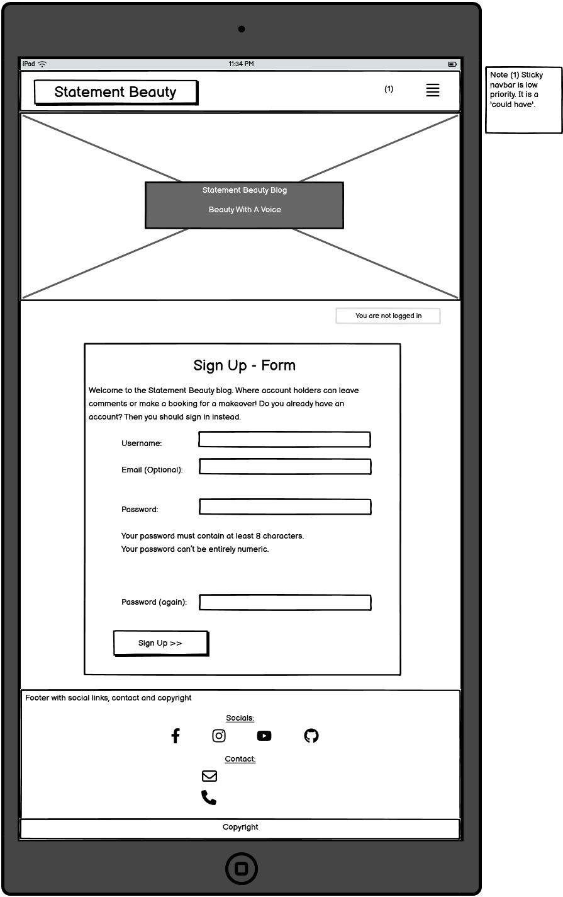

# Statement Beauty Blog

(Developer: Katie Dunne)

## Live website

Link to live website: [Statement Beauty](https://statement-beauty-ec9472f892b1.herokuapp.com/about/)

## Purpose of the project

Statement Beauty is a fictitious business that started out as a hair and makeup blog and had so much interest from expert beauticians that they were able to start offering makeover appointments (hair or makeup), which could be booked on the same site as the blog. This is a full stack website built using the Django web framework, with the aim of converting blog readers into makeover customers. This website is aimed at people that are interested in beauty topics. This website provides the user with; a blog, comments sections on posts, an about page to read about the business owner and the business itself, a form for users that are not registered to make collaboration requests, and an app for registered website users to make bookings for a makeover. The makeover app also describes whatever deal we have on makeovers, trending at that time. The makeover booking form provides the options for a hair or makeup appointment with a Statement Beauty beautician.

## Table of contents

## User experience (UX)

### Key project goals

-	Increase awareness of the Statement Beauty business, through a feel-good and accessible website that offers information of all things beauty through blogs
-	Encourage beauty professionals to get in contact if they would like to collaborate on blog posts or offer their services for our makeovers
-	Build a website that encourages and directs the site users to book a makeover with us

### Target audience

- Users that are enthusiastic about current beauty trends
- Users that would like to book to have their hair or makeup done for an upcoming event
- Users that are professionals in the beauty industry and would like to collaborate on blog posts or offer their own services through our makeover service

### User requirements and expectations

- An intuitively structured and visually appealing website that is easy to read on all screen sizes
- Navigation that is easy to use and understand whether using mobile, tablet or monitor
- Ability to quickly understand the purpose of the website
- An ability to register, login and logout
- An ability to interact with content by commenting
- An ability to read comments that have been made under blogs
- An ability to update and delete comments if desired
- An ability to find relevant information on the business and its services
- Access to a collaboration form
- An ability to make a booking for a makeover
- An ability to see a list of their own bookings
- An ability to update and delete bookings if desired
- Easy ways to contact the business
- An accessible website for all users

## Epics and user stories

### Epics

1. Fully functioning home page
2. Database and admin setup
3. Register page and form
4. Login page and form
5. Home page that looks different when logged in
6. Blog that has different capabilities when logged in compared to when not logged in
7. Log out page
8. About page
9. Book makeover

### User stories

- As a website user, I can:

1. Understand the purpose of this website quickly, so that I can stay interested and use the website to its full capability (Part of epic 1)
2. Navigate easily, so that I use all the capabilities of the website (Part of epic 1)
3. View a list of blogs that this site contains, so that I can find the posts I am interested in (Part of epic 1)
4. View the date a blog post was created, so that it is obvious which blogs are recent (Part of epic 1)
5. View the number of likes on blogs, so that it's easy to see which ones are popular (Part of epic 1)
6. Click on a blog post of interest that will then send the user to the login page, so that they can log in if not already logged in (Part of epic 4)
7. Register for an account, so that they can avail of the services offered to members (Part of epic 3)
8. Navigate to an about page, so that the user can view the overall mission statement of the website (Part of epic 8)

- As logged in website user, I can:

1. Like and unlike blog posts, so that I can show other users which posts are interesting (Part of epic 6)
2. Comment on blog posts, so that I can give my opinion and feel lots of interactivity with the website (Part of epic 2 and 6)
3. Read other users comments, so that I feel connected to a community (Part of epic 6)
4. Edit comments I made, so that I feel in control of the content I add to the website (Part of epic 2 and 6)
5. Delete my comments, so that I do not have to leave comments on the website forever (Part of epic 2 and 6)
6. Logout from the website, so that when I'm finished on the website, my comments are protected from editing by other computer users (Part of epic 5 and 7)
7. View deals of the season on makeovers, so that I can save some money by booking the makeover that is trending (Part of epic 9)
8. Fill in a form on the book makeover tab, so that I can inform the business owner of a time that suits me for my makeover

- As a logged in superuser, I can:

1. Create blog posts, so that I can share my opinion on certain beauty products and looks (Part of epic 2 and 6)
2. Read other users blog posts, so that I research what is trendy in the beauty community (Part of epic 6)
3. Edit blogs I made, so that I don't feel like the content I post has gone out of date (Part of epic 2 and 6)
4. Delete my blog posts if I wish to do so, so that I do not have to leave posts on the website forever (Part of epic 2 and 6)

- As a site owner, I can:

1. Allow comments to be shown to the casual website user, only if they have been approved
2. I can mark collaboration requests as read, so that I can see how many still need to be processed

- As a potential collaborator, I can:

1. Fill out a contact form to request collaboration on my project or idea (Part of epic 8)

## Features

### Logo and navigation bar

A responsive navigation bar is in place. Concentrating on 'mobile first' design, the navigation bar incorporates a clickable burger icon with a drop down menu on mobile. There is a burger icon at tablet size too but when moving to monitor size the burger disappears and a navigation bar appears with options to navigate to pages; 'Blog' which is essentially the home page, 'About' or 'Book Makeover'. There is a clickable brand logo for all screen sizes that loads the blog page.

### A list of blog posts

Individual blog posts are displayed under one another on mobile screens. On tablet screens there are 3 blog posts displayed in a row and 6 on a page, with the option to use a next and previous button. Large laptop screens and monitor screens have the same layout as tablet size only the pictures are bigger.

### See an individual blog post in detail

When a blog title or exerpt is clicked the post detail html is rendered displaying the same hero image that is on all pages, but also a mast head underneath the hero image with the blog title and an image that has been uploaded by a superuser. Underneath this the blog text can be seen. Underneat the blog text is a comment count, comments section and a form to add your own comment if you are a logged in user.

### About page

The user does not need to be logged in to view the about page. Here there is the hero image at the top. Then the div that tells the user whether they are logged in or not. Followed by; a portrait of the business owner, the about title and the about content. Underneath this is a collaboration form targeted at beauty professionals that would like to collaborate on blog posts or offer their services for our makeovers.

### Collaboration request form

### Book a makeover page

### Makeover deals

### Form with CRUD functionality to book a makeover when logged in

### View the bookings I have made when I am logged in

### View comments on posts

### CRUD functionality on comments when logged in

### Footer

## Future features

## Design

### Color

This website is a makeup and hair blog. The topics that this website will host are largely based around trends, therefore I decided to base the color palette for this project around the trending color of the year in 2024. The color trending for this year is 'Peach Fuzz' with the hexadecimal code of #FFBE98.

I also kept accessibility in mind when choosing colors and I used a color blind friendly palette. Colors were generated using [Venngage's accessible color palette generator](https://venngage.com/tools/accessible-color-palette-generator).

Primary Colors - White, Peach Fuzz

Secondary Colors - Light Purple, Light Pink

Only if further colors needed - Mustard, Green

- #FFBE98, peach fuzz that can be seen in the palette below
- #F0CCE2, a light purple that can be seen in palette shown
- #FFD8DD, a light pink that can be see in palette shown
- #FCD885, a mustard color that can be see in palette shown
- #C8D889, a green color that can be see in palette shown
- #FFFAE6, off-white

See color palette below for an illustration of all colors mentioned

## Wireframes

### Index page wireframes

### About page wireframes

### Book makeover page wireframes

### Blog Post Detail Page

### Register Page

### Log In Page

### Log Out Page

## Entity Relationship Diagrams

Please find a screenshot of tables below. These tables are in preparation for the final entity relationship diagram (ERD)

## Technology Used

- [HTML5](https://developer.mozilla.org/en-US/docs/Learn/HTML "link to html mozilla documentation")
  Used to create content and structure
- [CSS](https://developer.mozilla.org/en-US/docs/Learn/CSS "link to css mozilla documentation")
  Used to add custom styles
- [Django](https://www.djangoproject.com/ "link to django docs homepage")
  The python framework used to develop the site
- [Cloudinary](https://cloudinary.com/ "link to cloudinary homepage")
  Used to host images
- [GitHub](https://github.com/ "Link to github webpage")
  GitHub was used to store the code files, README files and assets
- [Heroku](https://id.heroku.com/login "Link to Heroku login")
  Heroku was used to deploy the project

## Testing

### Accessibility and Lighthouse

### Fixed bugs

1. Had to 'zero' the makeup models due to a data type change of integer field to text field.

2. Booking query was in the wrong place in the makeover_deals function in the makeover view.

3. Filter bookings bug

4. Navbar bug was fixed at the top of base.html 

### Unfixed bugs

### Supported screens and browsers

## Deployment

## Credits

### Code

### Media

### Inspiration for structure from CI walk through and other CI students

### Inspiration from beauty blogs

## Acknowledgements

Thank you to friends, family and pets for the huge support. Also thank you to my mentor and CI cohort facilitator :sparkles:
