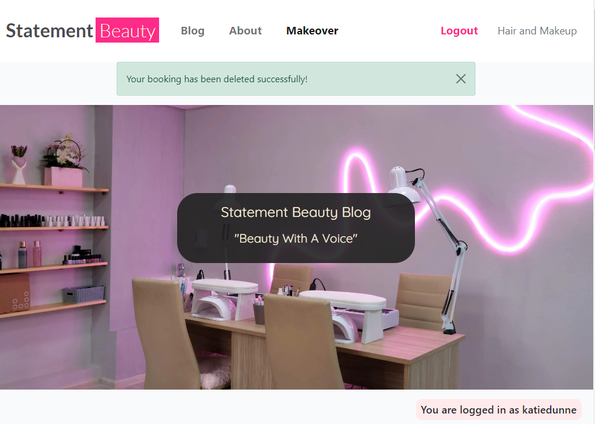
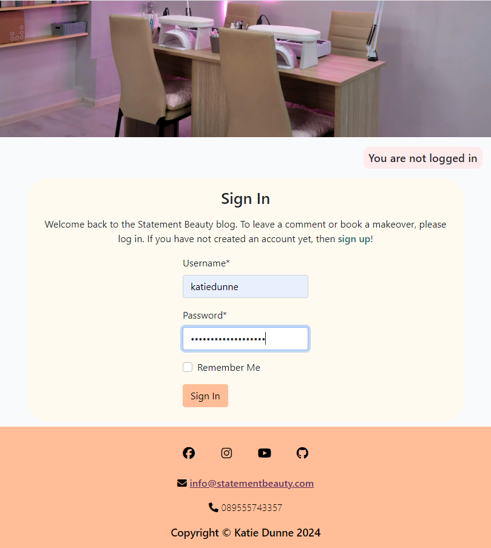
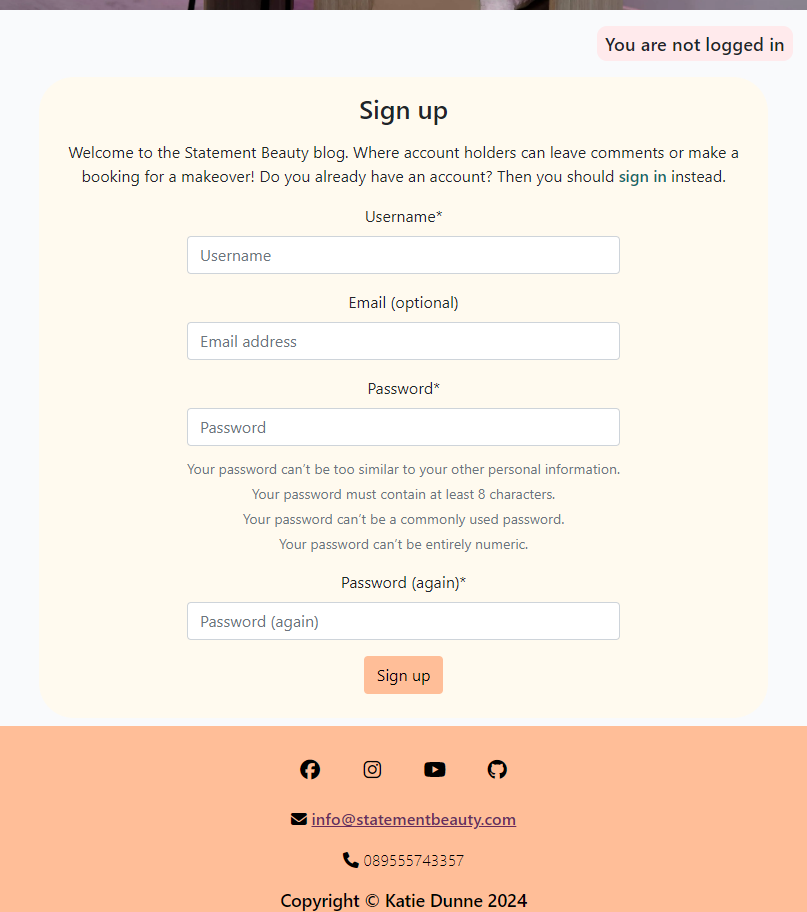
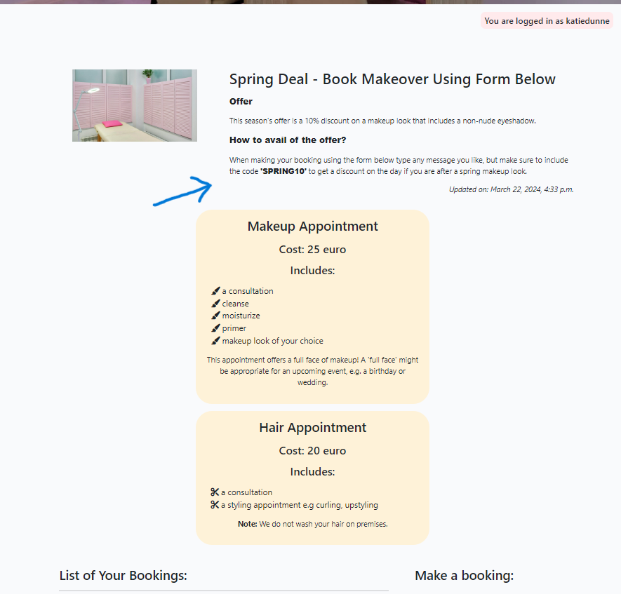
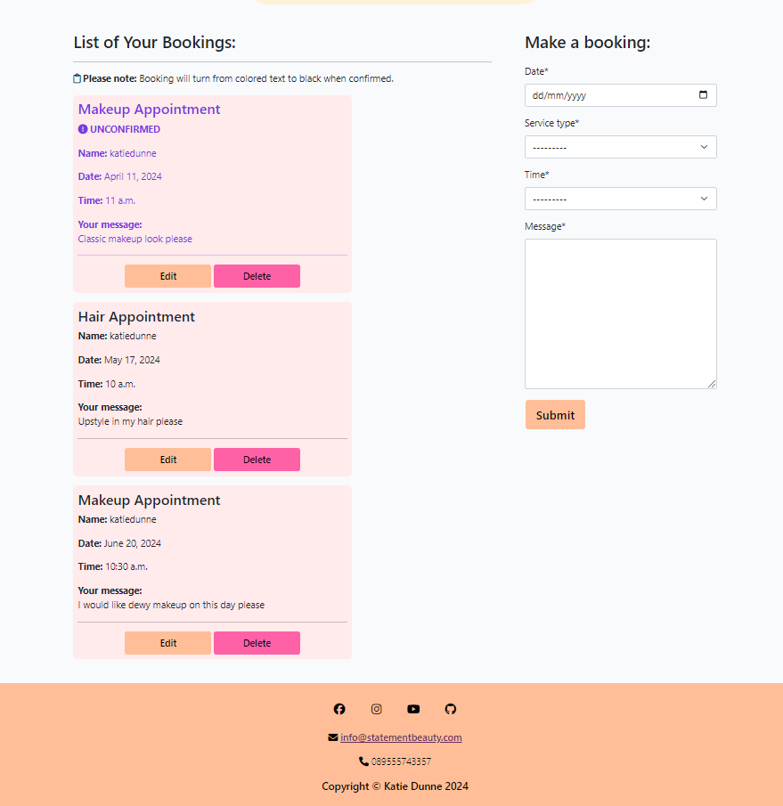
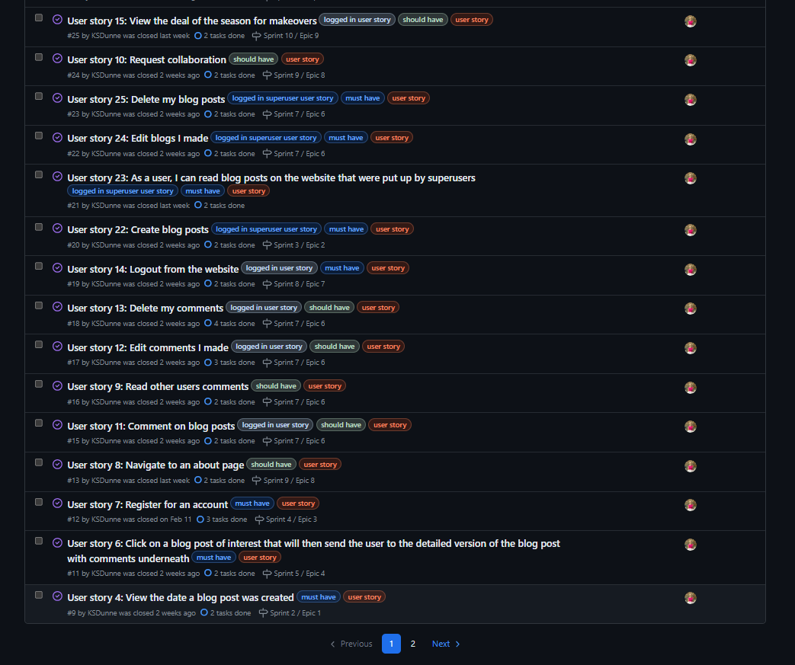
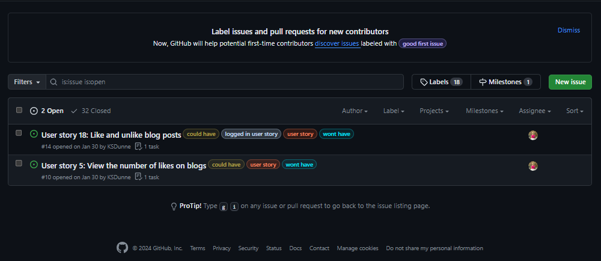

# Statement Beauty Blog

(Developer: Katie Dunne)

## Live website

Link to live website: [Statement Beauty](https://statement-beauty-ec9472f892b1.herokuapp.com)

## Purpose of the project

Statement Beauty is a fictitious business that started out as a blog and had so much interest from expert beauticians that they were able to start offering makeover appointments (hair or makeup), which could be booked on the same site as the blog. This is a full stack website built using the Django web framework, with the aim of converting blog readers into makeover customers. This website provides the user with; a blog, comments sections, an about page to read about the business owner and the business itself, a form for users that are not registered to make collaboration requests, and an app for registered website users to make bookings for a makeover. The makeover app also describes whatever deal we have on makeovers, trending at that time.

## Table of contents

- [Statement Beauty Blog](#statement-beauty-blog)
   * [User experience (UX)](#user-experience-ux)
      + [Key project goals](#key-project-goals)
      + [Target audience](#target-audience)
      + [User requirements and expectations](#user-requirements-and-expectations)
   * [Epics and user stories](#epics-and-user-stories)
      + [Epics](#epics)
      + [User stories](#user-stories)
   * [Features](#features)
      + [Logo and navigation bar](#logo-and-navigation-bar)
      + [Hero Image](#hero-image)
      + [Django alert messages](#django-alert-messages)
      + [Clear indication as to whether the user is logged in or out at all times](#clear-indication-as-to-whether-the-user-is-logged-in-or-out-at-all-times)
      + [Call to action button](#call-to-action-button)
      + [A list of blog posts](#a-list-of-blog-posts)
      + [See an individual blog post in detail](#see-an-individual-blog-post-in-detail)
      + [Pagination](#pagination)
      + [About page](#about-page)
      + [Collaboration request form](#collaboration-request-form)
      + [Sign in form](#sign-in-form)
      + [Register Form (Sign up)](#register-form-sign-up)
      + [Sign out page](#sign-out-page)
      + [Book a makeover page](#book-a-makeover-page)
      + [Makeover deals](#makeover-deals)
      + [Form with CRUD functionality to book a makeover when logged in](#form-with-crud-functionality-to-book-a-makeover-when-logged-in)
      + [View the bookings I have made when I am logged in](#view-the-bookings-i-have-made-when-i-am-logged-in)
      + [Edit the bookings I have made when I am logged in](#edit-the-bookings-i-have-made-when-i-am-logged-in)
      + [Delete the bookings I have made when I am logged in](#delete-the-bookings-i-have-made-when-i-am-logged-in)
      + [View comments on posts](#view-comments-on-posts)
      + [CRUD functionality on comments when logged in](#crud-functionality-on-comments-when-logged-in)
      + [Footer](#footer)
      + [Price of makeup and hair appointments](#price-of-makeup-and-hair-appointments)
      + [Custom 404 page](#custom-404-page)
      + [Custom 403 page](#custom-403-page)
      + [MoSCoW](#moscow)
   * [Future features](#future-features)
   * [Design](#design)
      + [Color](#color)
   * [Wireframes](#wireframes)
      + [Index page wireframes](#index-page-wireframes)
      + [About page wireframes](#about-page-wireframes)
      + [Book makeover page wireframes](#book-makeover-page-wireframes)
      + [Blog Post Detail Page](#blog-post-detail-page)
      + [Register Page](#register-page)
      + [Log In Page](#log-in-page)
      + [Log Out Page](#log-out-page)
   * [Database schema](#database-schema)
      + [Entity Relationship Diagrams](#entity-relationship-diagrams)
   * [Technology Used](#technology-used)
      + [Languages and framework](#languages-and-framework)
      + [Database](#database)
      + [Technologies and tools](#technologies-and-tools)
   * [Testing](#testing)
      + [Fixed bugs](#fixed-bugs)
      + [Unfixed bugs](#unfixed-bugs)
      + [Supported screens and browsers](#supported-screens-and-browsers)
   * [Deployment](#deployment)
      + [Pre Deployment](#pre-deployment)
      + [Deploying with heroku](#deploying-with-heroku)
      + [Fork this repository:](#fork-this-repository)
      + [Clone this repository:](#clone-this-repository)
   * [Credits](#credits)
      + [Code](#code)
      + [Media](#media)
      + [Inspiration from real world beauty blogs](#inspiration-from-real-world-beauty-blogs)
   * [Acknowledgements](#acknowledgements)

## User experience (UX)

### Key project goals

- Increase awareness of the Statement Beauty business, through a feel-good and accessible website that offers information of all things beauty through blogs (maps to epic 1 which has its associated user stories in issues, also see closed milestones)
- Encourage beauty professionals to get in contact if they would like to collaborate on blog posts or offer their services for our makeovers (maps to epic 8 which has its associated user stories in issues, also see closed milestones)
- Build a website that encourages and directs the site users to book a makeover with us (maps to epic 9 which has its associated user stories in issues, also see closed milestones)

### Target audience

- Users that are interested in current beauty trends and topics
- Users that would like to book to have their hair or makeup done for an upcoming event
- Users that are professionals in the beauty industry and would like to collaborate on blog posts or offer their own services through our makeover service

### User requirements and expectations

- An intuitively structured and visually appealing website that is easy to read on all screen sizes
- Navigation that is easy to use and understand whether using mobile, tablet or monitor
- Ability to quickly understand the purpose of the website
- An ability to register, login and logout
- An ability to interact with content by commenting
- An ability to read comments that have been made under blogs
- An ability to update and delete comments if desired
- An ability to find relevant information on the business and its services
- Access to a collaboration form
- An ability to make a booking for a makeover
- An ability to see a list of their own bookings
- An ability to update and delete bookings if desired
- Easy ways to contact the business
- An accessible website for all users

## Epics and user stories

### Epics

1. Fully functioning home page
2. Database and admin setup
3. Register page and form
4. Login page and form
5. Navigation bar that looks different when logged in
6. Blog detail page that has different capabilities when logged in compared to when not logged in
7. Log out page
8. About page
9. Book makeover page, that can be only accessed when logged in. This includes full front-end CRUD functionality for the user

### User stories

- As a website user, I can:

1. Understand the purpose of this website quickly, so that I can stay interested and use the website to its full capability (Part of epic 1)
2. Navigate easily, so that I use all the capabilities of the website (Part of epic 1)
3. View a list of blogs that this site contains, so that I can find the posts I am interested in (Part of epic 1)
4. View the date a blog post was created, so that it is obvious which blogs are recent (Part of epic 1)
5. View the number of likes on blogs, so that it's easy to see which ones are popular (Part of epic 1)
6. Click on a blog post title of interest that opens up that specific post in more detail (Part of epic 4)
7. Register for an account, so that I can avail of the services offered to members (Part of epic 3)
8. Navigate to an about page, so that the user can view the overall summary of the website capabilities and information on the CEO (Part of epic 8)
9. Read other users comments, so that I feel connected to a community (Part of epic 6)

- As a potential blog or makeover collaborator, I can:

10. Fill out a contact form to request collaboration on my project or idea (Part of epic 8)

- As logged in website user, I can:

11. Comment on blog posts, so that I can give my opinion and feel lots of interactivity with the website (Part of epic 6)
12. Edit comments I made, so that I feel in control of the content I add to the website (Part of epic 6)
13. Delete my comments, so that I do not have to leave comments on the website forever (Part of epic 6)
14. Logout from the website, so that when I'm finished on the website, my comments are protected from editing or deleting by other website users (Part of epic 7)
15. View deals of the season on makeovers, so that I can save some money by booking the makeover that is trending (Part of epic 9)
16. Book a makeover by filling in a form (part of epic 9)
17. See that the 'register' and 'login' buttons disappear on the navbar and the 'logout' button appears instead (Part of epic 5)
18. Like and unlike blog posts, so that I can show other users which posts are interesting (Part of epic 6)
19. Have full front-end CRUD on booking a makeover (epic 9)

- As a logged in superuser, I can:

20. Full backend CRUD on makeover bookings (epic 2)
21. Can approve bookings so that they turn from colored to black for the user (epic 2)
22. Create blog posts, so that I can share my opinion on certain beauty products and looks (Part of epic 2)
23. Read other users blog posts, so that I research what is trendy in the beauty community (Part of epic 6)
24. Edit blogs I made, so that I don't feel like the content I post has gone out of date (Part of epic 6)
25. Delete my blog posts if I wish to do so, so that I do not have to leave posts on the website forever (Part of epic 6)
26. Approve comments to be shown to the casual website user, only if they have been approved (epic 6)
27. I can mark collaboration requests as read, so that I can see how many still need to be processed (epic 2)

## Features

### Logo and navigation bar

A responsive navigation bar is in place. Concentrating on 'mobile first' design, the navigation bar incorporates a clickable burger icon with a drop down menu on mobile. There is a burger icon at tablet size too, but when moving to monitor size the burger disappears and a navigation bar appears with options to navigate to pages; 'Blog' which is essentially the home page, 'About' or 'Book Makeover'. There is a clickable brand logo for all screen sizes that loads the blog page. See mobile and monitor screenshots below.

#### Mobile navigation using burger menu

#### Monitor navigation bar

### Hero Image

The hero image was chosen to convey the main topic of the blog site. It is a beauty blog, so an image of a brightly colored nail salon was used.

### Django alert messages

Every time there is a change in data the user is alerted. For example when a comment is posted, when a comment is edited, when a comment is deleted, when a booking is created, when a booking is edited or when a booking is deleted. There is also an alert message displayed when a collaboration request is made. Below are 3 examples of alert messages, but there are many more shown throughout the site.

#### Django alert message example 1

The first example is a feedback notification that shows "successfully signed in as username" straight after signing in.

#### Django alert message example 2

The second example states "booking submitted! it will turn from colored to black when confirmed. phone us if you would like a short notice appointment." The is an example of a data change being conveyed to the user.

#### Django alert message example 3

The third example states "your booking has been deleted successfully!" This is another example of a data change being conveyed to the user.

### Clear indication as to whether the user is logged in or out at all times

The base html contains for whether the user is logged in or not and will display "You are logged in as username" or "You are not logged in" depending on the boolean state of authentication.

#### Clear indication for when the user is logged in

#### Clear indication for when the user is logged out

### Call to action button

The 'call to action' button is on the index page, so it is the first page the user normally lands on. The button includes the text 'Book Makeover'. One of the key project goals is to 'build a website that encourages and directs the site users to book a makeover with us'. A 'call to action' button is a common way to direct users to the main goal of a website.

### A list of blog posts

Individual blog posts are displayed under one another on mobile screens. On tablet screens there are 3 blog posts displayed in a row and 6 on a page, with the option to use a next and previous button. Large laptop screens and monitor screens have the same layout as tablet size only the pictures are bigger.

### See an individual blog post in detail

When a blog title or excerpt is clicked the post detail html is rendered displaying the same hero image that is on all pages, but also a mast head underneath the hero image with the blog title and an image that has been uploaded by a superuser. Underneath this the blog text can be seen. Underneath the blog text is a comment count, comments section and a form to add your own comment if you are a logged in user.

### Pagination

Pagination makes a long list of blog posts more manageable for users. It is comprised of 'next' and 'prev' buttons. Six blogs are shown per page on this website.

### About page

The user does not need to be logged in to view the about page. The hero image at the top. Then the div that tells the user whether they are logged in or not. Followed by; the about title (so that the user can confirm what page they are on), a portrait of the business owner, the content title and the about content. The about content tells the user about the business CEO and directs the user depending on whether they are a beauty 'enthusiast' or beauty 'professional'. It states "Enthusiast? Read our blog, register to leave comments or book a makeover!". Also it states, "Professional? Please fill in our form below if you would like to offer your services or if you would like to collaborate on a blog post!". Underneath this is a collaboration form targeted at beauty professionals that would like to collaborate on blog posts or offer their services for our makeovers.

### Collaboration request form

This is located at the bottom of the about page. I changed the model that was in I think therefore I blog to suit my needs by adding an 'interest' field with options to pick 'hair' 'makeup' or 'other'. Beauty professionals are encouraged to use this form. It should be ideally used by people that would like to collaborate on blogs or who can offer their professional services for the makeovers that statement beauty offer. In the Django administration panel there are green and red dots to indicate whether admin have read the request of not and an option to tick a box when it has been read.

### Sign in form

This is a crispy form that asks for username and password. It was styled with a yellow background.

### Register Form (Sign up)

This is a crispy form. I styled it with a light yellow background and I removed the bullet point dots that are normally present on the password instructions (e.g. your password must contain at least 8 characters). The username and password (x2) are required fields and the email is optional.

### Sign out page

The signout page is defensive. It asks the user 'Are you sure you would like to sign out?'

### Book a makeover page

An original custom model is contained in this original custom app. The app is called 'makeover' and it has its own template, models, form and views.

### Makeover deals

This is the text at the top of the 'book makeover' page. When 'makeovers' is clicked in the Django admin panel. A superuser can go there and edit the deal that the business is offering on makeovers at the moment. I made this so it can be edited from the admin panel because the deal will change often so it's handy that a superuser can change it as often as necessary. One of the first deals that was offered on the website is a 10% discount on a makeup makeover if the code SPRING10 is used in the message field when booking.

### Form with CRUD functionality to book a makeover when logged in

The whole 'book makeover' page is behind an authentication wall, where login is required. Django 'login required' decorators were added to the makeover views. Under a 'make a booking' heading, there are 4 fields. These 4 fields are as follows; date, service type, time and message. There was validation added to the date and time fields of this form. If a user chooses a date that is before today, a notification message appears saying 'Please select a date in the future'. If a user chooses today but the time is now or earlier, a notification message appears saying 'Please select a time in the future'.

### View the bookings I have made when I am logged in

When the user is logged in they can view a list of bookings they have already made. This list is ordered from the nearest date to furthest away date.

### Edit the bookings I have made when I am logged in

When the user is logged in they can edit bookings they have already made. The edit button sends the user to a new template within the makeover app. It is a template specifically for editing a booking, called 'edit_makeover.html'.

### Delete the bookings I have made when I am logged in

When the user is logged in they can delete bookings they have already made. The delete button sends the user to a new template within the makeover app. It is a template specifically for deleting a booking, called 'booking_confirm_delete.html'. This is a defensive page, as it asks the user 'Are you sure you want to delete booking?'. This page also warns the user that this action 'cannot be undone'.

### View comments on posts

A list of comments can be seen on individual posts when not logged in. However there is a note directing the user to 'Log in to leave a comment'. The user can create, read, edit and delete comments if they are logged in.

### CRUD functionality on comments when logged in

Full front end CRUD functionality is available on comments if the user is logged in. Every time data is created, edited or deleted a notification message pops up to give the user feedback.

### Footer

This includes social media icons, contact details (email and phone number) and copyright.

### Price of makeup and hair appointments

These are card like features that quote the price of the 2 different services offered (makeup appointment and hair appointment). There is an 'includes' section on the light yellow cards that explains in bullet point form what the appointment entails. This was a feature that was overlooked for mvp. It was suggested at the very end of the project when I put the statement beauty website on a slack channel for 'peer code review'. It makes a lot of sense to add a price to the service offerings and to explain what is involved in them so it was added in the final few days of the project. Therefore, this price feature was not in initial wireframes.

### Custom 404 page

I implemented a custom 404 page in this project to ensure users stay engaged even when encountering errors.

### Custom 403 page

A 403 page was implemented to assist with the UserPassesTestMixin. This page enhances security by informing users when they attempt an unauthorized action.

### MoSCoW

This project used the "MoSCoW" method to classify its features and requirements according to their importance towards a minimum viable product (MVP). "MoSCoW" stands for "Must have, Should have, Could have and Won't have," with each classification aiding in the prioritization of features. This method makes sure that essential components are tackled in priority order.

In the screenshot below it can be seen where 'must have' and 'should have' labels have been used and in the second screenshot underneath that one, it can be seen where 'could have' and 'won't have' labels were used.

See in the screenshot below that the 'could have' labels and 'wont have' labels ended up on the same issues. This is because they were just classified as 'could have' until I got near to the deadline. Then I realised I wouldn't have time to implement the like-feature, so it was moved to 'won't have'. This was acceptable, because the like-feature was not necessary for mvp. Normal agile project dynamics were demonstrated here.

## Future features

- A 'like' feature on the blog posts, with 'like' counter. This was on the project's kanban board as a 'could have'. However, it was moved to 'won't have' in the allowed timeframe for project submission. A like feature is something that can be implemented in future when time allows
- A search feature in the navigation bar to allow users to search for specific topics they are interested in
- Password reset so that if a user forgets their password they can regain access to their account
- Email confirmation sent to the user when their collaboration request is either received or read
- Email confirmation when a booking is confirmed
- Sticky navbar
- Merge 'static' and 'staticfiles' folders and implement the appropriate settings so that I only need the static folder instead of both

## Design

### Color

This website is a makeup and hair blog. The topics that this website will host are largely based around trends, therefore I decided to base the color palette for this project around the trending color of the year in 2024. The color trending for this year is 'Peach Fuzz' with the hexadecimal code of #FFBE98.

I also kept accessibility in mind when choosing colors and I used a color blind friendly palette. Colors were generated using [Venngage's accessible color palette generator](https://venngage.com/tools/accessible-color-palette-generator).

Primary Colors - White, Peach Fuzz

Secondary Colors - Light Purple, Light Pink

Only if further colors needed - Mustard, Green

- #FFBE98, peach fuzz that can be seen in the palette below
- #F0CCE2, a light purple that can be seen in palette shown
- #FFD8DD, a light pink that can be see in palette shown
- #FCD885, a mustard color that can be see in palette shown
- #C8D889, a green color that can be see in palette shown
- #FFFAE6, off-white

See color palette below for an illustration of all colors mentioned

All colors that were used in the end were generated as 'close to' the colors mentioned here, but were slightly changed due to either 'look' or 'lighthouse results' in the end. The colors mentioned here were the initial inspiration for the website - which was retained to a large extent with slight deviation.

## Wireframes

The overall structure was kept from initial inception of wireframes to the result of the website on submission for assessment. Three simple extra templates were added for; 1. editing a makeover booking, 2. deleting a makeover booking and for 3. deleting a comment. One extra button for resetting the comments form 'reset' was added. The price card feature was added to the book makeover page. These features all added value and contributed to better flow of the website. See all initial wireframes that were created early in the project timeline below.

### Index page wireframes

### About page wireframes

### Book makeover page wireframes

### Blog Post Detail Page

### Register Page

### Log In Page

### Log Out Page

## Database schema

In the diagram below it can be seen that User has a relationship to Post, Comment and Booking. Comment has a relationship with both User and Post.

### Entity Relationship Diagrams

Please find a screenshot of tables below. These tables are in preparation for the final entity relationship diagram (ERD). This excel sheet was my rough work that I prepared before making the database schema using dbdiagram.io, that can be seen above.

## Technology Used

### Languages and framework

- [HTML5](https://developer.mozilla.org/en-US/docs/Learn/HTML "link to html mozilla documentation")
  was used to create content and structure
- [CSS](https://developer.mozilla.org/en-US/docs/Learn/CSS "link to css mozilla documentation")
  was used to add custom styles
- [JavaScript](https://developer.mozilla.org/en-US/docs/Web/javascript "link to javascript mozilla documentation") was used to dynamically reset the comment form if the reset button was clicked and to show a modal when the edit comment button was clicked
- [Django](https://www.djangoproject.com/ "link to django docs homepage") was the python framework used to develop the site

### Database

- [PostgreSQL from Code Institute](https://dbs.ci-dbs.net/ "link to postgresql from code institute") was used as the PostgreSQL database for this project

### Technologies and tools

- [VS Code](https://code.visualstudio.com/ "link to visual studio code webpage") was used as the ide for this whole project
- [Cloudinary](https://cloudinary.com/ "link to cloudinary homepage") was used to host images
- [GitHub](https://github.com/ "link to github webpage") was used to store the code files, README files and assets
- [Git](https://git-scm.com/ "link to official git website") was used as a version control software to commit and push the code to the GitHub repository
- [Heroku](https://id.heroku.com/login "link to Heroku login") was used to deploy the project
- [dbdiagram](https://dbdiagram.io/ "link to dbdiagram") was used to make a diagram of the database schema. The diagram was based off erd tables that were documented in excel
- [Excel](https://microsoft.com/excel "link to official microsoft excel website") was used to created entity relationship tables in preparation for the database schema that was made in dbdiagram
- [Prettier](https://prettier.io/ "link to official prettier website") was used as the default formatter in Visual Studio Code IDE, for html and css files. The setting 'format on save' was used.
- [Black Formatter for Python](https://marketplace.visualstudio.com/items?itemName=ms-python.black-formatter "link to official black formatter website") was used as the default formatter in Visual Studio Code IDE, for python files. The setting 'format on save' was used.
- [Bootstrap](https://getbootstrap.com/ "link to official bootstrap website") was used to quickly layout, position and size critical website features
- [Balsamiq](https://balsamiq.com/wireframes/ "link to official balsamiq website") was used in early planning to map out wireframes
- [Google Fonts](https://fonts.google.com/ "link to official google fonts website") was used to import fonts
- [Favicon Generator](https://favicon.io/favicon-generator/ "link to official favicon generator website") was used to make an 'S' shaped favicon
- [Font Awesome](https://fontawesome.com/ "link to official font awesome website") was used for all icons
- [Google Chrome Developer Tools](https://developer.chrome.com/docs/devtools/overview/ "Link to official chrome developer tools website") was used for lighthouse testing, debugging and consistently checking responsiveness
- [W3C Markup Validator](https://validator.w3.org/ "link to official html validator") was used to validate all live html
- [Jigsaw CSS Validator](https://jigsaw.w3.org/css-validator/ "link to official css validator") was used to validate CSS code
- [JS Hint](https://jshint.com/ "link to official javascript validator") was used to validate JavaScript code
- [Code Institute Python Linter](https://pep8ci.herokuapp.com/ "link to official python validator") was used to validate all python code
- [Django Summernote](https://pypi.org/project/django-summernote/ "link to official summernote website") was used. This is a rich text editor plugin for Django
- [Django Crispy Forms](https://pypi.org/project/django-crispy-forms/ "link to official crispy forms website") were used throughout the project to quickly create forms
- [Chat-GPT](https://chat.openai.com/ "link to chat gpt") was used to create the text blog content. There are 18 blogs published on the Statement Beauty website and for each the following query was written into Chat-GPT: "Write 250 words on "blog title I have chosen" in a positive tone for a beauty blog". The blog text was edited slightly after it was taken from Chat-GPT

## Testing

Detailed testing documentation can be found [here.](./TESTING.md)

### Fixed bugs

1. Admin message for makeover booking

In the screen shot below is showing the 'after' of the fix. Where is underlined is how it should be. However, previous to this it just displayed an integer, such as "0" indicating "makeup appointment" or "1" indicating "hair appointment", but this would not have been good UX for the superusers, because it was not explicit, so it would have been easy to get confused. It was changed from an integer to text. When the data type change was done the makeup model had to be zero'd.

#### How the admin message looks now that it's fixed

#### What was changed to fix the admin message

2. Filter bookings bug

When I was logged in as username 'katiedunne' I was still being shown bookings from another user called 'Sophie. This can be seen in the screenshot below. This was fixed in 2 ways; by adding a login required decorator to the view, like this one '@login_required', and by adding a filter for the username to the query, i.e. '.filter(username=request.user)'.

#### What booking filter problem looked like

#### The code that was altered for the fix is in this screenshot

3. Navbar bug

I was on the makeover page but the navbar was showing the about page as bold. This was fixed by altering code at the top of base.html

#### What navbar problem looked like is in this screenshot

#### The code that was altered for the fix is in this screenshot

4. Cloudinary warning bug

The warnings that can be seen in the screenshot were appearing in the console. The warnings say that insecure elements were requested with http instead of https. These are the blog images that are hosted on cloudinary. When I encountered this problem I looked in the 'project-portfolio-4' channel on slack and another student had encountered this problem also. They used the following code in settings.py and this worked for removing the console warnings for them: 'cloudinary.config(secure=True)'. It worked to remove warnings for me too.

I was also having a problem with my cloudinary images being large so I changed a setting under the 'optimization' tab on cloudinary to 'economy mode' for default image quality. This improved the performance score in lighthouse, slightly. If time allowed a better solution for the image size problem might have been [django resized fields](https://pypi.org/project/django-resized/).

Here is a screenshot of the warnings I was getting:

Here is a screenshot of the solution to the http issue:

Here is a screenshot after it was fixed:

5. About page reload bug (The collaboration request form is sent again on page reload)

When a collaboration form is filled out, everything worked as it should and I got a confirmation message at the top of the screen, but during testing I noticed that if the page is refreshed it sends the collaboration request again. This is not very good for a couple of reasons. One reason is that multiple of the same request end up displaying in the admin panel. Another reason it is not best practice is that the user gets confused about whether they have indeed sent their request or not. The user just expects the page to do very little on refresh, or to clear the form.

I fixed this by adding the code in the screenshot below "return HttpResponseRedirect("/about/")". This seemed to fix the problem. However, when I asked for feedback from a peer, I was told the message is not displaying after a request is sent.

I then took the "return HttpResponseRedirect("/about/")" code back out of the view, because it is not necessary to have this 'reload issue' addressed for mvp. However, it is necessary that the feedback message displays to the user.

It is better that the feedback to the user is present. This reload issue, can be solved at a later date if it is proven to be a problem. Please see the screenshot below that shows the confirmation message for collaboration requests does indeed display to the user.

In conclusion for this 'collaboration form bug'. The user is warned on Chrome, that if they refresh their page, the form submission action may be repeated. The user is warned with the following message: "The page that you're looking for used information that you entered. Returning to that page might cause any action that you took to be repeated. Do you want to continue?". I tested on Firefox, Safari and Edge and similar messages are displayed to the user before refresh there too. Therefore, this is acceptable behaviour for now.

6. Makeover deals image

On mobile the makeover deals image was taking up a third of the page and this looked very small. So the bootstrap code was changed to make the image full width (12/12) on mobile and 4/12 on midsize screens upwards.

#### Before it was fixed it looked like this

#### After it was fixed it looked like this

#### This is the code that was altered

### Unfixed bugs

To my knowledge, on submission of this project for assessment, there are no unfixed bugs.

### Supported screens and browsers

#### Screens

- iPhone SE, 375px wide. Also looks good down to 300px according to devtools
- iPad Mini, 768px wide
- Nest Hub Max, 1280px wide

#### Browsers

- Chrome
- Firefox
- Safari
- Edge
- Opera

## Deployment

All code for this project was written in visual studio integrated development environment. Github was used for version control and the application was deployed to heroku from github.

### Pre Deployment

- To ensure successful deployment with heroku, it's good practice to make sure that the requirements.txt file is kept up to date so as that imported python modules are configured correctly.
- A Procfile is required to allow heroku deployment to be configured to a gunicorn web app.
- In settings.py configure the ALLOWED_HOSTS list the format ['app_name.heroku.com', 'localhost'], make sure all static files and directories are configured correctly.
- All environment variables on the env.py which gitignored on the repo must be configured correctly with the database url, cloundinary url and secret key.

### Deploying with heroku

After account setup, the steps were as follows:

- Click the "create new app" button on heroku
- Create a unique name for the app
- Select region (Europe was selected for this project)
- Click "create app"
- Select the deployment method (github was used for this project)
- Search for the github repository name (it was statement_beauty for this project)
- Click connect
- There is an option to use manual deployment or automatic deployment. Make sure main branch is selected
- In the settings tab select reveal config vars. Input the required hidden variables
- Select nodejs and python as the buildpack
- Deploy
- After the first deployment you will see a message saying "your app was successfully deployed" and there will be a "view" button to take you to your deployed application

The live link for this project can be found here - [Statement Beauty](https://statement-beauty-ec9472f892b1.herokuapp.com)

### Fork this repository:

- Go to the GitHub repository
- Click on the Fork button in the upper right-hand corner

### Clone this repository:

- Go to the GitHub repository
- Click the Code button near the top of the page
- Select 'HTTPS', 'SSH', or 'Github CLI', depending on how you would like to clone
- Click the copy button to copy the URL to your clipboard
- Open Git Bash
- Change the current working directory to where you want the cloned directory
- Type git clone and paste the URL ($ git clone https://github.com/YOUR-USERNAME/YOUR-REPOSITORY)
- Press enter to create your clone locally

Note: The difference between clone and fork is, you need permissions to push back to the original from a clone, but not a fork because a fork will be completely your own new project.

## Credits

### Code

[CI walkthrough I think therefore I blog](https://github.com/Code-Institute-Solutions/blog/tree/main/12_views_part_3/05_edit_delete) - The CI walkthrough repo was relied upon heavily, however I additionally created 1 whole custom app with associated custom models to suit the beauty theme of the website. The app I added was a makeover app where the user could make a booking for hair or makeup if they were logged in. This custom app has full front end CRUD functionality.

[Daisy's Recipe Edit Tutorial Repository](https://github.com/Dee-McG/Recipe-Tutorial/blob/main/recipes/views.py#L61) - Daisy uses an EditRecipe class to update a recipe. I adapted this class for my purpose which was to edit a booking.

[Daisy's Recipe Edit Tutorial YouTube Video](https://www.youtube.com/watch?v=JzDBCZTgVyw&list=PLXuTq6OsqZjbCSfiLNb2f1FOs8viArjWy&index=14) - Daisy explains how she creates the edit class in this video. I followed along with this video to write my EditBooking view in the makeover app.

[Daisy's Recipe Delete Tutorial Repository](https://github.com/Dee-McG/Recipe-Tutorial/blob/main/recipes/views.py#L72) - Daisy uses an DeleteRecipe class to delete a recipe. I adapted this class for my purpose which was to delete a booking.

[Daisy's Recipe Delete Tutorial YouTube Video](https://www.youtube.com/watch?v=nFa3lC105dM&list=PLXuTq6OsqZjbCSfiLNb2f1FOs8viArjWy&index=13) - Daisy explains how she creates the delete class in this video. I followed along with this video to write my DeleteBooking view in the makeover app.

[CI student booking website](https://github.com/DanMorriss/nialls-barbershop/blob/main/templates/base.html#L67) - Niall's Barbarshop footer looked similar to the way I wanted my footer, so their footer code was adapted for my use.

[CI student blog](https://github.com/DarrachBarneveld/CoolCoders-PP4/blob/main/templates/account/signup.html#L10) - This student's signup page looked how I wanted mine, so this code block was adapted to suit the style of statement beauty.

[Love Running Project August 2023](https://github.com/Code-Institute-Solutions/love-running-v3) - Head code and inspiration to use font awesome icons throughout the website

[Depreciated Love Running Project July 2023](https://github.com/Code-Institute-Solutions/love-running-2.0-sourcecode/tree/main) - Structure for hero image and tagline, animating zoom effect on the hero image when loading page

### Media

- The hero image is from [shutterstock](https://www.shutterstock.com/image-photo/interior-modern-nail-design-beauty-salon-2370398915)
- Blog image for highlighter that can be seen from space is from [pexels](https://www.pexels.com/photo/close-up-photo-of-woman-with-pink-eyeshadow-3912572/)
- Blog image for hollywood waves is from [pexels](https://www.pexels.com/photo/studio-portrait-of-a-young-brunette-woman-14673998/)
- Blog image for clipin hair extensions is from [unsplash](https://unsplash.com/photos/woman-in-black-and-gray-checked-tank-dress-stands-near-sunflower-HMPAXs9irhI)
- Blog image for eyeshadow palette is from [unsplash](https://unsplash.com/photos/white-and-brown-eyeshadow-palette-5Us84s7blq8)
- Blog image for makeup brushes is from [unsplash](https://unsplash.com/photos/brass-colored-and-black-makeup-brush-kit-b_pSSMpQgLI)
- Blog image for body brush is from [pixabay](https://pixabay.com/photos/bath-brush-spa-bad-tvaga-hygiene-6279441/)
- Blog image for caring for colored hair (pink hair pic) is from [picjumbo](https://picjumbo.com/scared-and-surprised-woman-with-an-open-mouth-and-pink-hair/)
- Blog image for contour like a pro is from [pexels](https://www.pexels.com/photo/woman-with-black-hair-doing-her-makeup-4006693/)
- Blog image for threading is from [unsplash](https://unsplash.com/photos/closeup-photography-of-womans-face-cowLgyb63c4)
- Blog image for laser hair removal is from [pixabay](https://pixabay.com/photos/model-dark-skin-cosmetology-5973472/)
- Blog image for heatless curls is from [unsplash](https://unsplash.com/photos/woman-wearing-white-shirt-standing-RrD8ypt8cjY)
- Blog image for french manicure is from [stockvault](https://www.stockvault.net/photo/185100/une-belle-french-manucure)
- Blog image for dewy makeup is from [pixabay](https://pixabay.com/photos/face-portrait-woman-girl-asian-7148051/)
- Blog image for peach blush is from [unsplash](https://unsplash.com/photos/woman-with-red-lipstick-and-black-mascara-7tz7I7naQ8c)
- Blog image for winter tanning is from [pixabay](https://pixabay.com/photos/woman-beach-people-sea-bikini-909323/)
- Blog image for eyeliner flick is from [unsplash](https://unsplash.com/photos/woman-in-black-crew-neck-shirt-smiling-LgftFZJe_oQ)
- Default image for blogs and static image for makeover deals is a bed in a salon and that's from [pexels](https://www.pexels.com/photo/massage-table-in-modern-cosmetology-salon-6899551/)

### Inspiration from real world beauty blogs

[Caroline Hirons beauty blog](https://www.carolinehirons.com/)

[Really Ree beauty blog](https://reallyree.com/)

[Sosueme beauty blog](https://sosueme.ie/)

## Acknowledgements

Thank you to friends, family and pets for the huge support. Also thank you to my mentor and CI cohort facilitator :sparkles:
