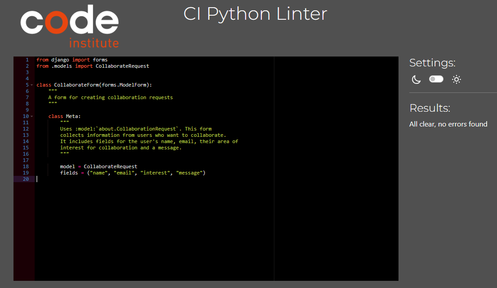
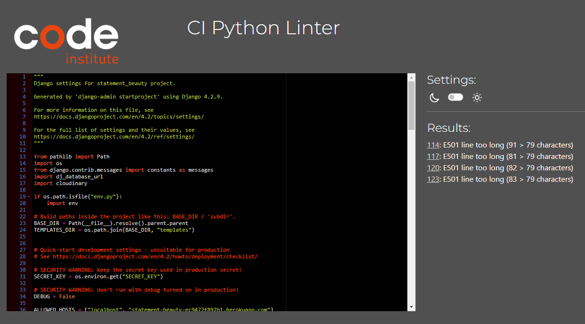
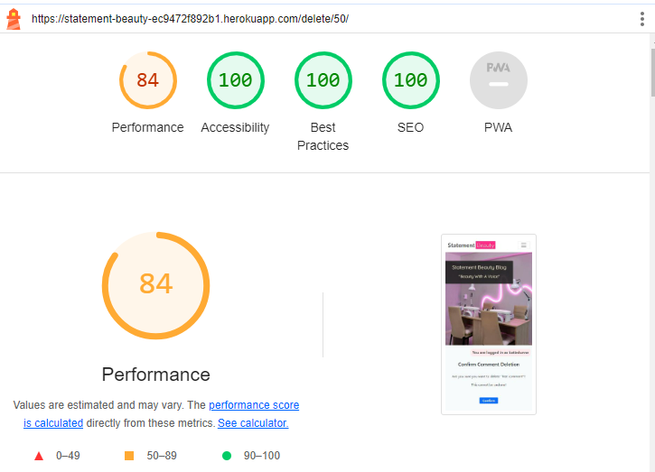

## Code Validation

### HTML

All HTML pages were tested with the [W3C HTML Validator](https://validator.w3.org/).

#### HTML Result

| page                   | validator                                                                                                                               | result |
| ---------------------- | --------------------------------------------------------------------------------------------------------------------------------------- | ------ |
| blog                   |  

Blog Page

                          | PASS   |
| about                  |  

About Page

                        | PASS   |
| makeover               |  

Makeover Page

             | PASS   |
| post detail logged out |  

Post Detail Logged Out

 | PASS   |
| post detail logged in  |  

Post Detail Logged In

   | PASS   |
| sign up page           |  

Register

                         | PASS   |
| sign in page           |  

Sign In

                           | PASS   |
| logout page            |  

Sign Out

                         | PASS   |
| edit booking page      |  

Edit Booking

                   | PASS   |
| delete booking page    |  

Delete Booking

        | PASS   |
| delete comment page    |  

Delete Comment

        | PASS   |

The info messages that were ignored appeared in validation, because I used the [Prettier](https://prettier.io/) plugin in VS code. Prettier is hardcoded to add trailing slashes. Since all of my attributes were quoted, there is no effect of the trailing slash. After some research and finding the following 2 links I decided that it is ok to ignore these info messages in this instance.

- [Stack overflow](https://stackoverflow.com/questions/77343449/using-of-trailing-slash-in-void-element) - information on trailing slash

- [Github](https://github.com/validator/validator/wiki/Markup-%C2%BB-Void-elements#configuring-tools-to-not-output-trailing-slashes-for-void-elements) - information on trailing slash

### CSS

Custom CSS was put through the [W3C CSS Validator](https://jigsaw.w3.org/css-validator/).

#### CSS Result

Pass

Explaination of 3 warnings

Warning 1: Imported style sheets are not checked in direct input and file upload modes. This warning can be ignored in this instance.

- [Stack overflow](https://stackoverflow.com/questions/25946111/importing-css-is-ending-up-with-an-error) - the google style sheet is not checked in the validator

Warning 2: -webkit-transform is a vendor extension. This warning can be ignored in this instance.

- [Stack overflow](https://stackoverflow.com/questions/30607832/w3c-css-validation-error-using-calc-and-vendor-extensions) - vendor-specific extensions (mostly) do adhere to the CSS 2.1 grammar, but since they are not defined in the CSS 2.1 specification, they are marked as invalid in the validator.

Warning 3: -moz-transform is a vendor extension. This warning can be ignored in this instance.

- [Stack overflow](https://stackoverflow.com/questions/30607832/w3c-css-validation-error-using-calc-and-vendor-extensions) - vendor-specific extensions (mostly) do adhere to the CSS 2.1 grammar, but since they are not defined in the CSS 2.1 specification, they are marked as invalid in the validator.

### JavaScript

JavaScript code in the comment.js file was put through the [JSHint Validator](https://jshint.com/).

#### JS Result

The js code passed. There is 1 undefined variable: bootstrap. However, this warning can be ignored in this instance because the variable is imported with the CDN connection in the base.html file.

### Python

All python code was put through the [CI Python Linter](https://pep8ci.herokuapp.com/).

#### Python Result

| File            | Validator                                                                                                                | Result |
| --------------- | ------------------------------------------------------------------------------------------------------------------------ | ------ |
| About models    |  

About Models

       | PASS   |
| About views     |  

About Views

         | PASS   |
| About forms     |  

About Forms

         | PASS   |
| About urls      |  

About urls

           | PASS   |
| About admin     |  

About Admin

         | PASS   |
| Blog models     |  

Blog Models

        | PASS   |
| Blog views      |  

Blog Views

          | PASS   |
| Blog forms      |  

Blog Forms

          | PASS   |
| Blog urls       |  

Blog urls

            | PASS   |
| Blog admin      |  

Blog Admin

          | PASS   |
| Makeover models |  

Makeover Models

 | PASS   |
| Makeover views  |  

Makeover Views

   | PASS   |
| Makeover forms  |  

Makeover Forms

   | PASS   |
| Makeover urls   |  

Makeover urls

     | PASS   |
| Makeover admin  |  

Makeover Admin

   | PASS   |
| Settings        |  

Settings

               | PASS   |

There were 4 'line too long' results left in the settings file. It was left without refactoring because this is Django specific code for password validation.

## Lighthouse

Performance, accessibility, best practices and seo were tested using [lighthouse](https://developer.chrome.com/docs/lighthouse/overview/) in Chrome DevTools.

### Lighthouse results table

| page                   | performance | accessibility | best practices | seo | screenshot                                                                                                                                 | result |
| ---------------------- | ----------- | ------------- | -------------- | --- | ------------------------------------------------------------------------------------------------------------------------------------------ | ------ |
| blog                   | 78          | 100           | 100            | 100 |  

Blog Page

                               | PASS   |
| about                  | 80          | 100           | 100            | 100 |  

About Page

                             | PASS   |
| makeover               | 76          | 100           | 100            | 100 |  

Makeover Page

                       | PASS   |
| post detail logged out | 81          | 100           | 100            | 100 |  

Post Detail Logged Out

 | PASS   |
| post detail logged in  | 70          | 100           | 100            | 100 |  

Post Detail Logged In

   | PASS   |
| sign up page           | 84          | 100           | 100            | 100 |  

Register

                              | PASS   |
| sign in page           | 85          | 100           | 100            | 100 |  

Sign In

                                | PASS   |
| logout page            | 84          | 100           | 100            | 100 |  

Sign Out

                              | PASS   |
| edit booking page      | 84          | 100           | 100            | 100 |  

Edit Booking

                   | PASS   |
| delete booking page    | 84          | 100           | 100            | 100 |  

Delete Booking

               | PASS   |
| delete comment page    | 84          | 100           | 100            | 100 |  

Delete Comment

                | PASS   |

### Lighthouse result explanation

This website's landing blog page got 100% score for accessibility, best practices and seo. Performance score is between 70-80, which is a 'PASS' because it is orange. This score is acceptable in the current context.

I have explained below how I tried to improve this score and other ways it could have been improved if time allowed.

#### What I did to imporve performance

Performance on the blog page is fluctuating between 70-80 every time it is tested. [Documentation](https://developer.chrome.com/docs/lighthouse/performance/performance-scoring/#fluctuations) says this is normal. The following was done during testing to try and improve the performance score:

- The hero image size was reduced and image type was changed to webp
- The placeholder image for blogs was reduced in size and the type was changed from jpg to webp
- The cloudinary settings in the profile specific to me and this project were changed. I went to the optimization page of settings and I went to 'default image quality'. I changed this setting from 'good quality' to 'economy mode'.
- There were also console warnings saying that the image urls were not secure so a configuration of secure=True was added to settings.py.

The first performance score I got on the blog page was 69% and after doing all of these steps, it went up to a score of 81% during one test, so I think these steps did make an improvement. The project will be submitted in the state it is in currently (shown in screenshots). However, if time allowed there is one more solution that could be tried. It is explained below.

#### If time allowed, the following could have been done to improve performance

If time allowed, the image fields could be switched to [django resized fields](https://pypi.org/project/django-resized/). For further instructions on this. Codu have a [blog](https://www.codu.co/articles/resizing-images-and-converting-formats-in-django-1rj9kdho) about resizing images and converting formats in Django.

If there is a blog with different superusers uploading images they can be uploaded in lots of different file formats and sizes so what this solution essentially does is force all images to convert to webp and resize them all to a certain quality.

## Manual testing

### Makeover booking date and time validation

| User action                                | Validation error                                            | Does it work as expected? |
| ------------------------------------------ | ----------------------------------------------------------- | ------------------------- |
| User selects a date < today                | Please select a date in the future.                         | PASS                      |
| User selects a time today < now            | Please select a time in the future.                         | PASS                      |
| User selects a time and date already taken | That time is already taken, please select a different time. | PASS                      |

### Notifications and feedback testing for booking a makoever

| Action                                | Notifications and feedback for booking                                                                                       | Does it work as expected? |
| ------------------------------------- | ---------------------------------------------------------------------------------------------------------------------------- | ------------------------- |
| Book a valid makeover                 | Booking submitted! It will turn from colored to black when confirmed. Phone us if you would like a short-notice appointment. | PASS                      |
| Edit a makeover                       | Your booking has been updated!                                                                                               | PASS                      |
| Edit a makeover (back to unconfirmed) | Goes back to unconfirmed with a color change                                                                                 | PASS                      |
| Delete a makeover                     | Your booking has been deleted successfully!                                                                                  | PASS                      |
| When confirmed in admin panel         | Booking changes from purple to black                                                                                         | PASS                      |

### Notifications and feedback testing for comments

| Action                                                    | Notifications and feedback for comments                | Does it work as expected? |
| --------------------------------------------------------- | ------------------------------------------------------ | ------------------------- |
| Logged out and looking at comments                        | It should say "log in to leave a comment"              | PASS                      |
| Submit a comment                                          | Comment submitted and awaiting approval                | PASS                      |
| Delete a comment                                          | Your comment has been deleted successfully!            | PASS                      |
| Edit a comment modal                                      | Modal pops up with directions on how to edit a comment | PASS                      |
| Comment text in box on click of edit                      | Targeted text appears in comment box                   | PASS                      |
| When edit button is clicked                               | The word submit changes to update                      | PASS                      |
| Change mind about editing, can click reset                | Resets update back to submit and clears comment box    | PASS                      |
| Wrote a comment you don’t want to submit, can click reset | Resets comment box                                     | PASS                      |
| Edit a comment successfully                               | Comment Updated! Notification appears                  | PASS                      |

### Notifications and feedback testing for collaboration form

| Action                         | Notifications and feedback for comments                                 | Does it work as expected? |
| ------------------------------ | ----------------------------------------------------------------------- | ------------------------- |
| Submit a collaboration request | Collaboration request received! I try to respond within 2 working days. | PASS                      |

### Notifications and feedback testing for register, signin and signout

| Action   | Notifications and feedback for signin and out | Does it work as expected? |
| -------- | --------------------------------------------- | ------------------------- |
| signin   | Successfully signed in as username.           | PASS                      |
| signout  | You have signed out.                          | PASS                      |
| register | Successfully signed in as username.           | PASS                      |

### Notifications and feedback testing for admin panel

| Action                                                | Notifications and feedback for comments                                                         | Does it work as expected? |
| ----------------------------------------------------- | ----------------------------------------------------------------------------------------------- | ------------------------- |
| When collaboration request is marked as read in admin | The collaborate request “Collaboration request from username” was changed successfully.         | PASS                      |
| When a comment has been approved in admin             | The comment “Comment 'test' by 'username'” was changed successfully.                            | PASS                      |
| When a comment is deleted by admin                    | Successfully deleted 1 comment.                                                                 | PASS                      |
| When more than 1 comment is deleted by admin          | Successfully deleted 2 comments.                                                                | PASS                      |
| When a booking is confirmed in admin                  | The booking “Hair Appointment for username on 2024-05-24 at 09:00:00” was changed successfully. | PASS                      |
| When a booking is deleted by admin                    | Successfully deleted 1 booking.                                                                 | PASS                      |
| When admin deletes more than 1 booking                | Successfully deleted 2 bookings.                                                                | PASS                      |

### Testing all links and buttons on website

|    | clickable link                                         | what does it do?                                              | does it work as expected? |
| -- | ------------------------------------------------------ | ------------------------------------------------------------- | ------------------------- |
| 1  | clickable statement beauty brand in top left of screen | returns to blog/index page                                    | PASS                      |
| 2  | navbar blog link                                       | brings user to blog page                                      | PASS                      |
| 3  | navbar about link                                      | brings user to about page                                     | PASS                      |
| 4  | navbar book makeover link when logged in               | brings user to book makeover page                             | PASS                      |
| 5  | navbar book makeover link when logged out              | sends user to login page                                      | PASS                      |
| 6  | navbar register button                                 | brings user to signup page                                    | PASS                      |
| 7  | navbar login button                                    | brings user to login page                                     | PASS                      |
| 8  | navbar logout button                                   | brings user to a signout page                                 | PASS                      |
| 9  | clickable blog title                                   | sends user to post detail page                                | PASS                      |
| 10 | clickable exerpt                                       | sends user to post detail page                                | PASS                      |
| 11 | next button                                            | sends user to next 6 blog items                               | PASS                      |
| 12 | prev button                                            | sends user to previous 6 blog items                           | PASS                      |
| 13 | footer facebook icon                                   | sends user to facebook login                                  | PASS                      |
| 14 | footer instagram icon                                  | sends user to instagram login                                 | PASS                      |
| 15 | footer youtube icon                                    | sends user to youtube                                         | PASS                      |
| 16 | footer github icon                                     | sends user to the developers github profile                   | PASS                      |
| 17 | post detail edit button                                | changes submit to update and populates comment box            | PASS                      |
| 18 | post detail delete button                              | sends user to a defensive are you sure page                   | PASS                      |
| 19 | post detail submit button                              | submits a comment for approval                                | PASS                      |
| 20 | post detail reset button                               | resets the update button to submit and resets the comment box | PASS                      |
| 21 | collaborate submit button                              | submits the collaborate form                                  | PASS                      |
| 22 | edit button on makeover page                           | sends user to an edit booking page                            | PASS                      |
| 23 | delete button on makeover page                         | sends user to a defensive deletion page                       | PASS                      |
| 24 | book makeover submit button                            | submits a booking                                             | PASS                      |     

### Feature testing table

|    | feature                         | action                                                 | effect                                                      |
| -- | ------------------------------- | ------------------------------------------------------ | ----------------------------------------------------------- |
| 1  | nav bar home >768px             | hover items with mouse                                 | underlines and shows the correct destination for a click    |
| 2  | drop down nav menu on 320 px    | when burger is clicked                                 | drops down and makes active page bold                       |
| 3  | drop down nav menu on 768 px    | when burger is clicked                                 | drops down and makes active page bold                       |
| 4  | zoom of hero image on all pages | on page load / refresh                                 | works as intended, checked on personal iphone and dev tools |
| 5  | unconfirmed bookings            | are purple with and unconfirmed notice on them         | works as intended                                           |
| 6  | confirmed bookings              | turn black and the word unconfirmed disappears         | works as intended                                           |
| 7  | unconfirmed comments            | are purple with an awating approval notice on them     | works as intended                                           |
| 8  | confirmed comments              | turn black and the awaiting approval notice disappears | works as intended                                           |
| 9  | blog comments form              | submit successfully when the form is valid             | works as intended                                           |
| 10 | about collaboration form        | submit successfully when the form is valid             | works as intended                                           |
| 11 | book makeover form              | submit successfully when the form is valid             | works as intended                                           |

## Responsiveness

- Responsiveness of features was tested using Chrome DevTools.

- All features were tested for the intended look and responsiveness on iPhone SE, 375px wide, iPad Mini, 768px wide and Nest Hub Max,1280px wide. I also consistently tested the look and responsiveness down to 300px throughout development.

- All features passed responsiveness testing and looked good on all devices mentioned. 

- See responsive feature testing results in the table below.

| item to check for responsiveness                  | index | about | book makeover | post detail logged out | post detail logged in | sign up page | sign in page | logout page | edit booking page | delete booking page | delete comment page |
| ------------------------------------------------- | ----- | ----- | ------------- | ---------------------- | --------------------- | ------------ | ------------ | ----------- | ----------------- | ------------------- | ------------------- |
| navbar                                            | PASS  | PASS  | PASS          | PASS                   | PASS                  | PASS         | PASS         | PASS        | PASS              | PASS                | PASS                |
| hero image                                        | PASS  | PASS  | PASS          | PASS                   | PASS                  | PASS         | PASS         | PASS        | PASS              | PASS                | PASS                |
| cover text                                        | PASS  | PASS  | PASS          | PASS                   | PASS                  | PASS         | PASS         | PASS        | PASS              | PASS                | PASS                |
| tagline                                           | PASS  | PASS  | PASS          | PASS                   | PASS                  | PASS         | PASS         | PASS        | PASS              | PASS                | PASS                |
| you are logged in as                              | PASS  | PASS  | PASS          | PASS                   | PASS                  | PASS         | PASS         | PASS        | PASS              | PASS                | PASS                |
| arrangement of blogs (under each other on mobile) | PASS  | na    | na            | na                     | na                    | na           | na           | na          | na                | na                  | na                  |
| blog pictures                                     | PASS  | na    | na            | PASS                   | PASS                  | na           | na           | na          | na                | na                  | na                  |
| blog exerpts                                      | PASS  | na    | na            | na                     | na                    | na           | na           | na          | na                | na                  | na                  |
| footer                                            | PASS  | PASS  | PASS          | PASS                   | PASS                  | PASS         | PASS         | PASS        | PASS              | PASS                | PASS                |
| collaboration form                                | na    | PASS  | na            | na                     | na                    | na           | na           | na          | na                | na                  | na                  |
| delete and edit buttons on comments               | na    | na    | na            | na                     | PASS                  | na           | na           | na          | na                | na                  | na                  |
| submit and reset buttons on comment form          | na    | na    | na            | na                     | PASS                  | na           | na           | na          | na                | na                  | na                  |
| edit and delete buttons on makeover booking       | na    | na    | PASS          | na                     | na                    | na           | na           | na          | na                | na                  | na                  |
| appointment cards                                 | na    | na    | PASS          | na                     | na                    | na           | na           | na          | na                | na                  | na                  |
| comment cards                                     | na    | na    | na            | PASS                   | PASS                  | na           | na           | na          | na                | na                  | na                  |
| booking form                                      | na    | na    | PASS          | na                     | na                    | na           | na           | na          | na                | na                  | na                  |
| sign up form                                      | na    | na    | na            | na                     | na                    | PASS         | na           | na          | na                | na                  | na                  |
| sign in form                                      | na    | na    | na            | na                     | na                    | na           | PASS         | na          | na                | na                  | na                  |

## Browser compatibility

 - All pages were tested for 'intended appearance' and 'responsiveness' on the following browsers; Chrome, Firefox, Safari, Edge and Opera

- See browser compatibility testing results in the table below

### Intended appearance on different browsers

| intended appearance (on monitor) | chrome | edge | firefox | safari | opera |
| -------------------------------- | ------ | ---- | ------- | ------ | ----- |
| blog                             | pass   | pass | pass    | pass   | pass  |
| about                            | pass   | pass | pass    | pass   | pass  |
| makeover                         | pass   | pass | pass    | pass   | pass  |
| post detail logged out           | pass   | pass | pass    | pass   | pass  |
| post detail logged in            | pass   | pass | pass    | pass   | pass  |
| sign up page                     | pass   | pass | pass    | pass   | pass  |
| sign in page                     | pass   | pass | pass    | pass   | pass  |
| logout page                      | pass   | pass | pass    | pass   | pass  |
| edit booking page                | pass   | pass | pass    | pass   | pass  |
| delete booking page              | pass   | pass | pass    | pass   | pass  |
| delete comment page              | pass   | pass | pass    | pass   | pass  |

### Intended responsiveness on different browsers

Intended responsiveness was tested on a monitor using different browsers while constantly changing window sizes

| intended responsiveness (on monitor) | chrome | edge | firefox | safari | opera |
| ------------------------------------ | ------ | ---- | ------- | ------ | ----- |
| blog                                 | pass   | pass | pass    | pass   | pass  |
| about                                | pass   | pass | pass    | pass   | pass  |
| makeover                             | pass   | pass | pass    | pass   | pass  |
| post detail logged out               | pass   | pass | pass    | pass   | pass  |
| post detail logged in                | pass   | pass | pass    | pass   | pass  |
| sign up page                         | pass   | pass | pass    | pass   | pass  |
| sign in page                         | pass   | pass | pass    | pass   | pass  |
| logout page                          | pass   | pass | pass    | pass   | pass  |
| edit booking page                    | pass   | pass | pass    | pass   | pass  |
| delete booking page                  | pass   | pass | pass    | pass   | pass  |
| delete comment page                  | pass   | pass | pass    | pass   | pass  |

## Device compatibility

## User story testing