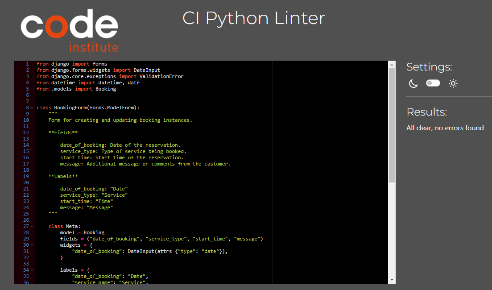

## Code Validation

### HTML

All HTML pages were tested with the [W3C HTML Validator](https://validator.w3.org/).

#### HTML Result

| page                   | validator                                                                                                                               | result |
| ---------------------- | --------------------------------------------------------------------------------------------------------------------------------------- | ------ |
| blog                   |  

Blog Page

                          | PASS   |
| about                  |  

About Page

                        | PASS   |
| makeover               |  

Makeover Page

             | PASS   |
| post detail logged out |  

Post Detail Logged Out

 | PASS   |
| post detail logged in  |  

Post Detail Logged In

   | PASS   |
| sign up page           |  

Register

                         | PASS   |
| sign in page           |  

Sign In

                           | PASS   |
| logout page            |  

Sign Out

                         | PASS   |
| edit booking page      |  

Edit Booking

                   | PASS   |
| delete booking page    |  

Delete Booking

        | PASS   |
| delete comment page    |  

Delete Comment

        | PASS   |

The info messages that were ignored appeared in validation, because I used the [Prettier](https://prettier.io/) plugin in VS code. Prettier is hardcoded to add trailing slashes. Since all of my attributes were quoted, there is no effect of the trailing slash. After some research and finding the following 2 links I decided that it is ok to ignore these info messages in this instance.

- [Stack overflow](https://stackoverflow.com/questions/77343449/using-of-trailing-slash-in-void-element) - information on trailing slash

- [Github](https://github.com/validator/validator/wiki/Markup-%C2%BB-Void-elements#configuring-tools-to-not-output-trailing-slashes-for-void-elements) - information on trailing slash

### CSS

Custom CSS was put through the [W3C CSS Validator](https://jigsaw.w3.org/css-validator/).

#### CSS Result

Pass

Explaination of 3 warnings

Warning 1: Imported style sheets are not checked in direct input and file upload modes. This warning can be ignored in this instance.

- [Stack overflow](https://stackoverflow.com/questions/25946111/importing-css-is-ending-up-with-an-error) - the google style sheet is not checked in the validator

Warning 2: -webkit-transform is a vendor extension. This warning can be ignored in this instance.

- [Stack overflow](https://stackoverflow.com/questions/30607832/w3c-css-validation-error-using-calc-and-vendor-extensions) - vendor-specific extensions (mostly) do adhere to the CSS 2.1 grammar, but since they are not defined in the CSS 2.1 specification, they are marked as invalid in the validator.

Warning 3: -moz-transform is a vendor extension. This warning can be ignored in this instance.

- [Stack overflow](https://stackoverflow.com/questions/30607832/w3c-css-validation-error-using-calc-and-vendor-extensions) - vendor-specific extensions (mostly) do adhere to the CSS 2.1 grammar, but since they are not defined in the CSS 2.1 specification, they are marked as invalid in the validator.

### JavaScript

JavaScript code in the comment.js file was put through the [JSHint Validator](https://jshint.com/).

#### JS Result

### Python

All python code was put through the [CI Python Linter](https://pep8ci.herokuapp.com/).

#### Python Result

| File            | Validator                                                                                                                | Result |
| --------------- | ------------------------------------------------------------------------------------------------------------------------ | ------ |
| About models    |  

About Models

       | PASS   |
| About views     |  

About Views

         | PASS   |
| About forms     |  

About Forms

         | PASS   |
| About urls      |  

About urls

           | PASS   |
| About admin     |  

About Admin

         | PASS   |
| Blog models     |  

Blog Models

        | PASS   |
| Blog views      |  

Blog Views

          | PASS   |
| Blog forms      |  

Blog Forms

          | PASS   |
| Blog urls       |  

Blog urls

            | PASS   |
| Blog admin      |  

Blog Admin

          | PASS   |
| Makeover models |  

Makeover Models

 | PASS   |
| Makeover views  |  

Makeover Views

   | PASS   |
| Makeover forms  |  

Makeover Forms

   | PASS   |
| Makeover urls   |  

Makeover urls

     | PASS   |
| Makeover admin  |  

Makeover Admin

   | PASS   |
| Settings        |  

Settings

               | PASS   |

There were 4 'line too long' results left in the settings file. It was left without refactoring because this is Django specific code for password validation.

## Lighthouse

### Lighthouse result

This website's landing blog page got 100% score for accessibility, best practices and seo. Performance score is between 70-80.

### Lighthouse result explaination

Performance is fluctuating between 70-80 everytime it is tested. [Documentation](https://developer.chrome.com/docs/lighthouse/performance/performance-scoring/#fluctuations) says this is normal. The following was done during testing to try and imporve the performance score:

- The hero image size was reduced and image type was changed to webp
- The placeholder image for blogs was reduced in size and the type was changed from jpg to webp
- The cloudinary settings in the profile specific to me and this project were changed. I went to the optimization page of settings and I went to 'default image quality'. I changed this setting from 'good quality' to 'economy mode'.
- There were also console warnings saying that the image urls were not secure so a configuration of secure=True was added to settings.py.

The very first performance score I got on lighthouse was 69% and after doing all of these steps, it went up to a score of 81% during one test, so I think these steps did make an improvement. I will submit the project in this state. However, if time allowed there is one more solution that could be tried and that would be the following:

If time allowed, the image fields coule be switched to [django resized fields](https://pypi.org/project/django-resized/).

